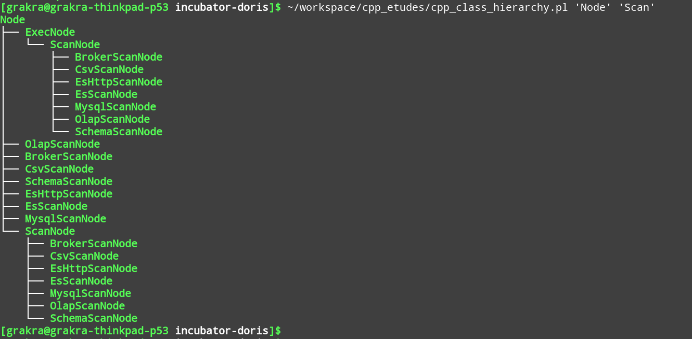
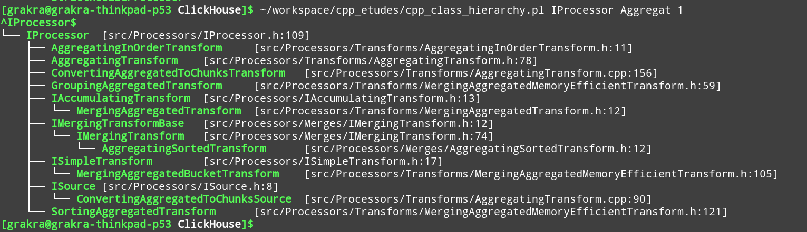

# cpp\_etudes

cpp\_etudes is a cpp project integrated with google benchmark, google test for validating cpp features and refining vectorized builtin function of databases. It can be
built by both clang and gcc. Some interesting perl scripts are also included.


## Scripts

### csvtable.pl: create a ascii-border table from CSV format.

1. create a csv file

```shell
cat >repeat.csv  <<'DONE'
t,vectorization,new-vectorization,non-vectorization,new speedup,vectorization speedup
repeat/const_times,3112ms, 9797ms, 13986ms(4X memory),3.14,4.49
repeat/const_s, 8107ms, 30231ms, 39501ms(32X memory), 3.72,4.87
repeat,9141ms, 32182ms,44315ms(32X memory), 3.52,4.84
DONE
```

2. generate a ascii-border table

```
cat repeat.csv |./csvtable.pl

+====================+===============+===================+=====================+=============+=======================+
| test               | vectorization | new-vectorization | non-vectorization   | new speedup | vectorization speedup |
+====================+===============+===================+=====================+=============+=======================+
| repeat/const_times | 3112ms        | 9797ms            | 13986ms(4X memory)  | 3.14        | 4.49                  |
| repeat/const_s     | 8107ms        | 30231ms           | 39501ms(32X memory) | 3.72        | 4.87                  |
| repeat             | 9141ms        | 32182ms           | 44315ms(32X memory) | 3.52        | 4.84                  |
+--------------------+---------------+-------------------+---------------------+-------------+-----------------------+
```

### cpptree.pl: show class hierarchy of cpp project in the style of Linux utility tree.

1. usage, try with incubator-doris, other cpp projects are just ok.

```
# format

./cpptree.pl <keyword|regex> <filter> <verbose(0|1)> <depth(num)>
- keyword for exact match, regex for fuzzy match;
- subtrees whose leaf nodes does not match filter are pruned, default value is '' means match all;
- verbose=0, no file locations output; otherwise succinctly output;
- depth=num, print max derivation depth.

git clone https://github.com/satanson/incubator-doris.git
cd incubator-doris

# show all classes
./cpptree.pl '\w+'

# show all classes with file locations.
./cpptree.pl '\w+' '' 1

# show all classes exact-match ExecNode if ExecNode class exists
./cpptree.pl 'ExecNode' '' 1

# show all classes fuzzy-match regex '.*Node$' if the literal class name not exists.
./cpptree.pl '.*Node$' '' 1

# show all classes and depth of derivation relationship is less than 3
./cpptree.pl '\w+' '' 1 3

# show all classes whose ancestor class matches 'Node' and itself or its offsprings matches 'Scan'
/cpptree.pl 'Node' 'Scan'

```
2. some outputs

```
cd incubator-doris
./cpptree.pl 'ExecNode'
```


```
cd ClickHouse
./cpptree.pl IProcessor
```


```
cd ClickHouse
./cpptree.pl IDataType '' 1
```


```
cd incubator-doris
./cpptree.pl 'Node' 'Scan'
```


```
cd ClickHouse
./cpptree.pl IProcessor Aggregat 1
```


### color\_palette.pl: show color palette for colorful terminal output.

1. usage
```
./color_palette.pl
```


