# Lucene Partial Source Code Chewing
# satanson@DorisDB

----
## TOC
1. **Motivation & Workload**
2. **Data Model**
3. **In-memory & On-disk Storage**
4. **ACID**
5. **Space/Read/Write Amplification**
6. **Update mechanism**
7. **Misc**

----

##  Motivation & Workload

### Motivation

#### 1. ingest non-structured/semi-structured datasets
- logs printed by system services via log4j, glog and etc.
- user-generated documents.

#### 2. answer queries as follows
- show me documents whose fields match given terms.
- aggregation/sorting on some fields of the documents.
- just return a subset of fields of the matched documents. 

----

###  Workload

#### 1. document/log db
- process datasets consisting of documents.
- full-text search;
- source filtering: return a subset of fields. 

#### 2. operations
- insert/update/deletion
- query

#### 3. partitioning
- dataset scales incrementally as new documents ingested.
- search on some involved portion of the dataset efficiently.

#### 4. aggregation/sorting:
- aggregation/sorting on some fields of semi-structured documents.

----

### ElasticSearch & Lucene
- ElasticSearch is a document db matching our motivation & workloads;
- Lucene is local storage engine at the core of ES;
- Lucene to ES, as RocksDB to TiKV;
- ElasticSearch engages in partitioning & replication.
- One Lucene instance in charge of one shard replica.
- Lucene stores and indexes docuements belongs to the shard replica of its own.
- ES splits query into subqueries, then dispatches subqueries to involved shard replicas, then gathers and merges result sets.

----

## Data Model

### Index
- Index/document/field in ES, just like table/tuple/column in RDBMS.
- Field value is tokenized by analyzer into tokens and inverted index is built on it.
- A term is a pair (field name, token), i.e. the same tokens from different fields are different terms.
- A index in ES is partitioned and replicated,   index in Lucene, just is shard replica of ES Index.

### Index Pattern
- Index in ES has a name;
- A index pattern is a index name glob.
- You can rollover one index for each hour;  e.g. `log_2020_08_22_00`, `log_2020_08_22_01`, ..., `log_2020_08_22_23`;  Index pattern `log_2020_08_22_*` match all indexes.
- A query can be launched on an index pattern.

### Contrast with Doris
- A index pattern is like a table in Doris;
- A index is like a table partition in Doris;
- A index shard is like a bucket of a table partition in Doris;
- A index shard replica(i.e. a lucene index) is like tablet replica in Doris.

----

## Data Model

### Document
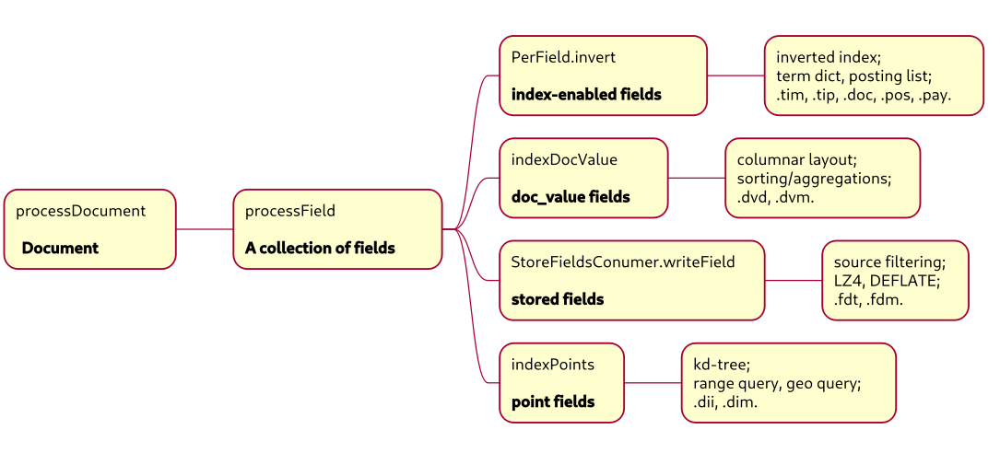

### field types
- string typed: 
	- text: tokenized, can not stored as doc_values,  for full-text search;
	- keyword: not tokenized, stored as doc_values in default, for dimensional column;
	- wildcard: ngram, wildcard quey.
- numeric typed: byte, short, integer, long, float, double;
- date time: long;
- geo-typed: array of numeric values;

### index-enabled fields
- string-typed fields (**text**);
- term dictionary/posting list;
- position, position data (offset, payload): proximity query, phrase query, highlight;
- norms, term vector: scoring, document ranking.
### stored fields

- row layout;

- indexed fields is not stored in default, so you cannot get verbatim documents;
- ES use field `_source` to store whole documents;
- source filtering: store partial fields which you want return.
### doc values
- columnar layout;
- dimensional fields:  string-typed(**keyword**);
- measure fields: numeric-typed;
- sorting, user-specified a group of sorting fields;
- all the numeric-typed stored as long, including the floating-typed.

### points
- kd-tree;
- range query;
- geo query.

## In-memory & On-disk Storage

### Lucene vs LevelDB vs DorisDB vs HBase

| **Local storage engine** | **In-memory structure**                     | **On-disk structure** | Update                                                       | Flush/Compaction                                             |
| ------------------------ | ------------------------------------------- | --------------------- | ------------------------------------------------------------ | ------------------------------------------------------------ |
| Lucene                   | DWPT<br/>DocumentsWriterPerThread           | Segment               | multi-versioned;<br/>record updates in DWDeleteQueue; <br/>apply updates to segment at the proper moment;<br/>commit point with largest generation wins. | concurrent flush/compaction;<br/>indexing threads help FULL_FLUSH thread; <br/>background compaction;<br/>TieredMergePolicy;<br/>LogMergePolicy;<br/>size-trigger. |
| LevelDB                  | MemTable                                    | SSTable, log          | multi-versioned;<br/>append new entry;<br/>max LSN wins.     | serial flush/compaction;<br/>single background compaction thread;<br/>leveled compaction;<br/>size-trigger/seek-trigger. |
| HBase                    | MemStore<br/>ConcurrentSkipListMap          | HFile, HLog           | multi-versioned;<br/>append new entry;<br/>max sequenceId wins. | concurrent flush/compaction;<br/>in-memory compaction;<br/>major compaction;<br/>size-based compaction. |


### In writer(IndexWriter) perspective

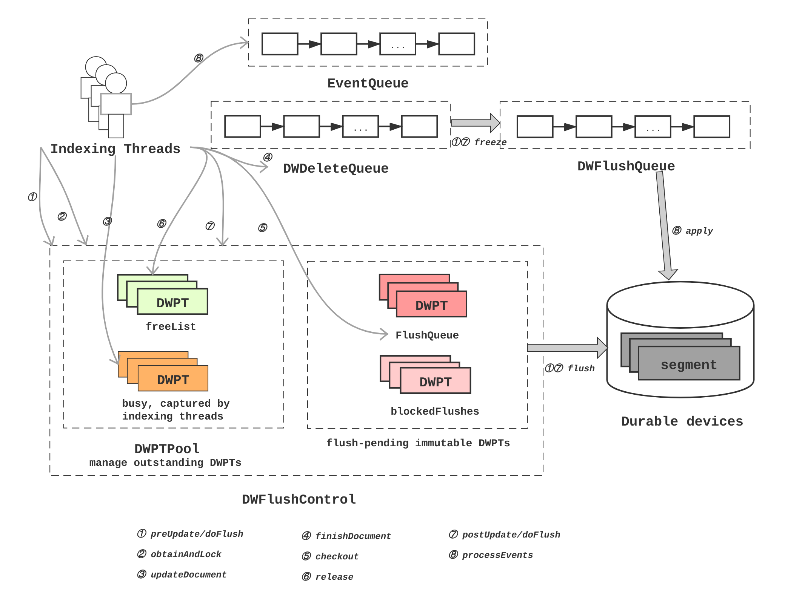

### In reader(IndexReader) perspective

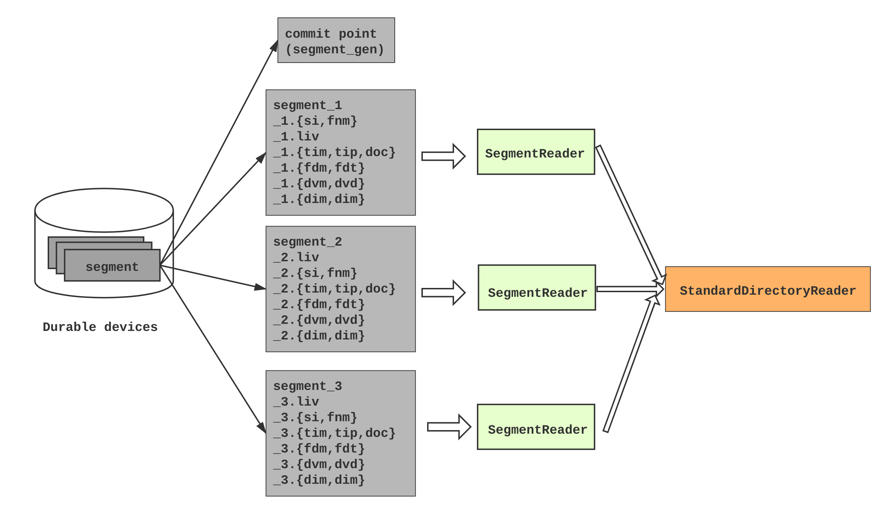

## ACID
###  Atomicity
- Lucene has no WAL, so system use Lucene as the local engine should provide WAL to commit efficiently;
- ES employs **translog** to enhance atomicity and durability;
- Lucene use IndexWriter::commit method to commit latest data;
- You can read latest uncommitted data after FULL_FLUSH;
- A batch of update/insert operations take effect in all-or-nothing style.

### Consistency

- A document is deleted if any parts of (inverted index, stored fields, doc values, points) fails to process;
- No primary key, so no primary key constraints;
- No unique key constraints, too.

### Isolation

- Documents insides WDPTs  have continuous monotonic-increasing WDPT-specific docIds start from zero, in according to their ingesting order;
- Inter-WDPT operations synchronized by DWDeleteQueue,  these operations contend to get  monotonic-increasing seqNo.
- Deletions and doc_values updates will be apply to external segments, on which operations take effect in seqNo order and synchronized by DWFlushQueue;
- Updates and segments have monotonic-increasing generation numbers, updates shall be applied to segments whose generation numbers are less than counterpart of the updates.

### Durability

- IndexWriter::commit, heavy lifting operation;
- fsync  index directory;
- fsync new-modified files in directory;
- write segment info files and a commit point file, then fsync;
- ES uses translog for data persistence, so can use full flush instead IndexWriter::commit to make the latest data visible,  and IndexWriter::commit can be used to checkpoint data and truncate translog.


## Space/Read/Write Amplification

### key points

- Use sophisticated and elaborated codecs and compressions to save space and read/write more data efficiently;
- Merge small files into big ones to gc  docIds of dead documents and improve locality;
- Buffered read/write operations amortize IO cost to a block of  bytes;
- Both reader and writer threads can do full flush, indexing threads help to complete full flushes in progress;
- Deletions just modify bitmaps of live documents (.liv), rather than modifies posting list, doc values,  store fields and etc.

### Codecs

#### PackedInts

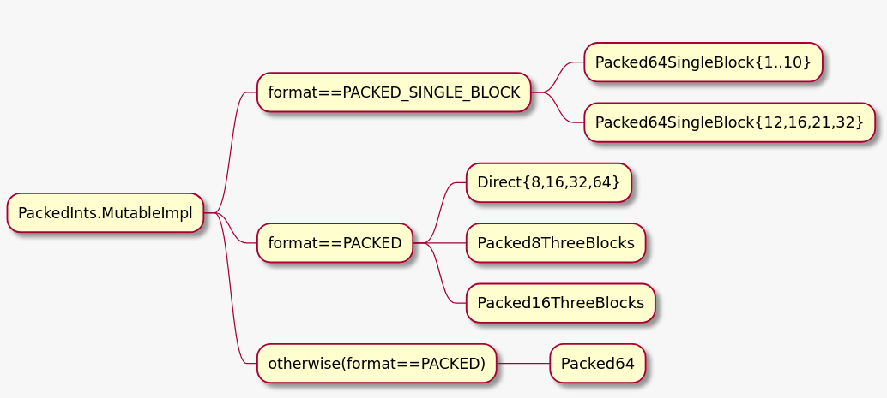

- Packed narrow integers to eliminate gaps and paddings;
- Packed64SingleBlock series:  no value span dword(long typed, 8 bytes) boundaries,  rear bits of dword maybe waste,  i.e.  5-bit integer;
- Direct series:  no bits waste, only supports {8,16,32,64}-bit;
- PackedThreeBlocks series: no bits waste, only supports {24, 48}-bit;
- Packed64: no bits waste, a value can span dword boundaries.

#### Delta codec

- Transform as follows:

```
min = min(values)
values = [ x - min for x in values]
```

- PackedInts encoding

#### Monotonic  delta codec

- Input values is sorted  or quasi-sorted;

- transform as follows:

```
slope = (values[n-1] - values[0])/(n-1)
values = [ values[i]-i*slope for i in range(0,len(values))]
min = min(values)
values = [ x - min for x in values]
```

- PackedInts encoding.

#### Delta/gcd codec

- Coarse-grained date time represented in {sec, ms, micrco-sec, nano-sec} unit benefits from this codec;

```
min = min(values)
gcd = min(values)
values = [ (x - min)/gcd for x in values]
```

- PackedInts encoding.

#### Dictionary codec

- The number of unique values is small (<=255),  sort, then use ordinals instead original values;
- Save codec tables;
- Use PackedInt encoding.

####  Bitmap codec

- Dense monotonic values;
- One bit per value.

### Binary codec

- Given array of blob/clob;
- Write blob one by one literally to byte array or byte output stream, no paddings or gaps;
- Use offsets in byte array instead of blobs itself;
- Offsets adopts monotonic delta codec.

#### Sorted string codec

- Sort strings in lexicographic order, then use delta encoding in LevelDB;
- Then use ordinals instead of strings;
- Use numeric value encoding.


### Doc values

- Lucene has no primary keys, although you can use a field with unique terms to simulate primary keys, however, it's not clustering.

- Each segment has its private docId as search key; when search, at first we use several terms to search inverted index, get a set of docIds, then use docId to search doc values and stored fields;

- Columnar layout: in a DWPT or a segment,  values of the same field whose `doc_values`  parameter enabled,  are encoded and stored as an clustering entirety;  all doc_value fields values  are stored in one file;

- The input data of the columnar layout are two arrays of the same size, one contains monotonic docIds, the other contains field values corresponding to docIds;

- In memory,  the docId array adopts bitmap codec; the codec of value array depends on its element type;

- Numeric-typed values: values are encoded in delta codec;

  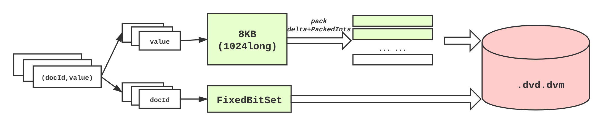

- Binary-typed values:  values are encoded in binary codec, but length array instead of offset array is encoded;

  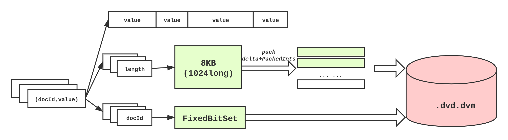

- Sorted-typed values:  values are encoded in the sorted string codec;

  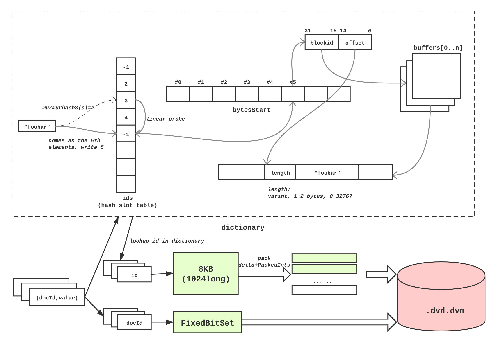

- On-disk layout is a little complex.

#### Numeric-typed doc values on-disk layout

- Per-field doc values has one-to-one per-field metadata;

  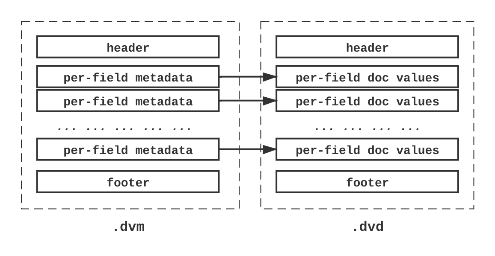

- If the number of unique values  less than 256 and dictionary encoding is more space-efficient than delta/gcd encoding, then use dictionary encoding;

- When No documents with values, then write no docId blocks or value blocks;

- When all documents with values, no need to write docId blocks;

  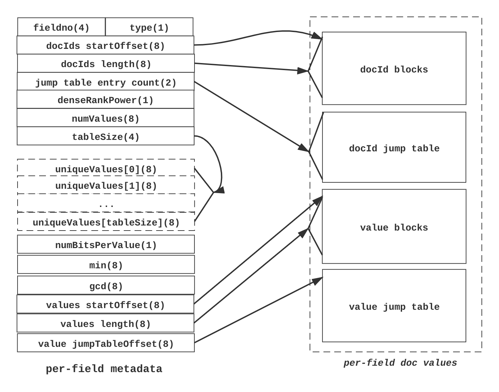

- DocId jump table used to search potential target docId block contains  a given docId quickly;

- Higher 16-bit of docId used as an docId block Id;

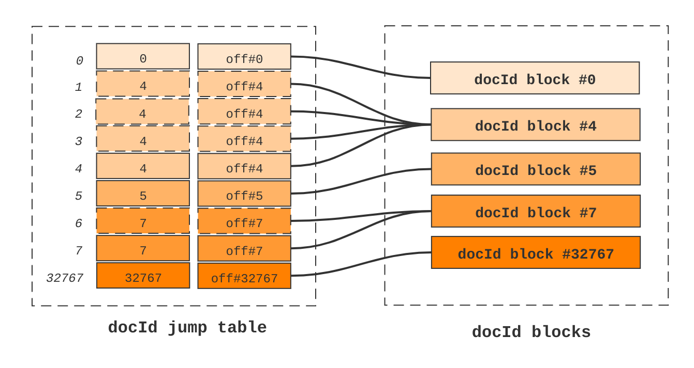

- Search inside a docId block use lower 16-bit of docIds;

- With sparse encoding, binary-search can be used to locate the ordinal of a docId;

- With dense encoding, binary-searching rank array to get target 512-bit block fast, then search inside the block;

  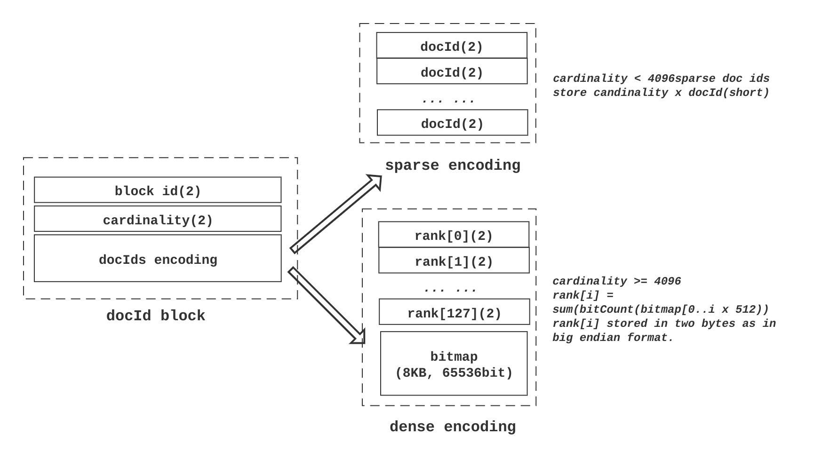

- If dictionary encoding is less space-efficient, compare delta/gcd encoding on single block to encoding on multiple blocks, the latter policy is chosen only if it save 10% space.


#### Binary-typed doc values on-disk layout.

  - Similar to numeric-typed;
  - Blob stream is written into .dvd file;
  - StartOffsets of blobs instead of lengths (in-memory structure) are encoded in monotonic delta codec.

#### Sorted-type doc values on-disk layout.

- Similar to numeric-typed;
- Before encoding on disk, terms has the order same to their arrival order, so reorder terms alphabetically and generate a mapping from old ordinals to new ones, then rewrite the values;
- Values just packed via PackedInts.Direct;
- Sorted terms encoded in LevelDB-style delta codec, restart interval width is 16;
- A reverse term index is also saved for seeking a given term.

#### Other doc values types

- Sorted numeric: a multi-value field of numeric-typed;
- Sorted set:  a multi-value field of  string-typed.

### Stored fields

- Fields indexed but not stored, can't be get back;

- ES use a stored field `_source` to save a entire document literally;

- Stored fields of documents adopt row layout,  all the stored fields of each document cluster in a .fdt file;

- Several documents whose accumulated length exceeds 16KB or the number of which exceeds 128 form a chunk;

- Chunk split into 16KB slices. which are compressed by LZ4, one by one.

   

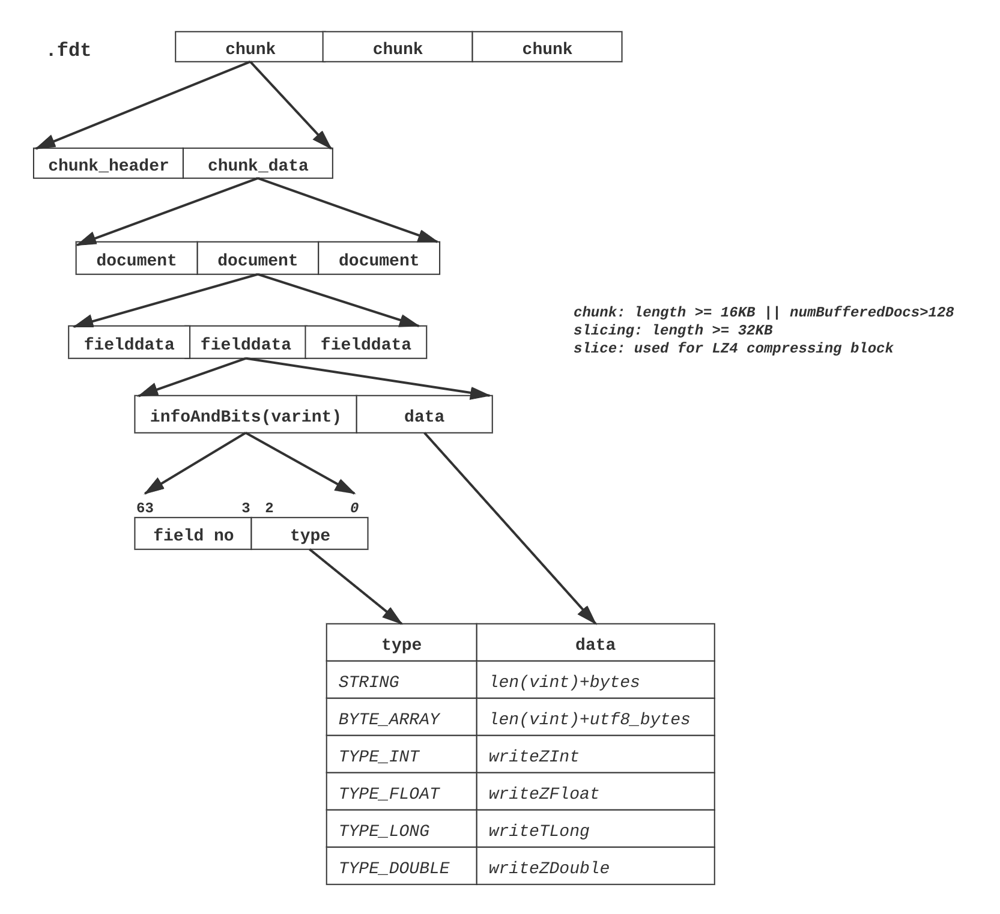


- A  chunk_header stores the metadata of the chunk;
- DocBase is the first docId in a chunk;
- Slice_bit == 1 indicates that chunk_data is sliced;
- A chunk has numDocs# documents, both numStoreFields and lengths array have numDocs# entries each of which maps to a document;
- Documents without any stored fields also occupy entries in numStoreFields and lengths array, so locate a document in a chunk easily;

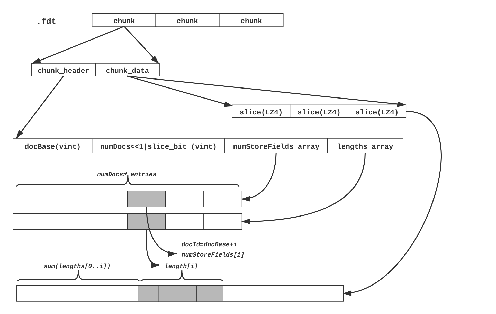

- .fdx is a  index to seek for the target chunk;
- Every chunk in .fdt has an index entry in .fdx;
- Every 1024 index entries are encoded together to save space;

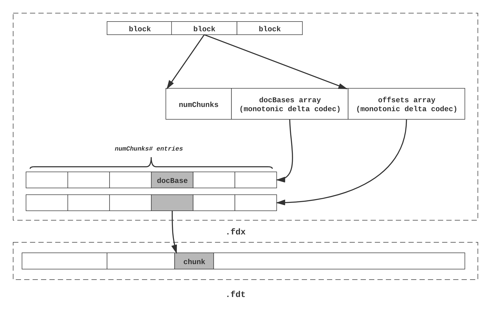

### Other layouts

- Points: kd-tree;
- Inverted index: term directory and posting list.


## Update mechanism

### Update operation type supported

- Delete documents match a query;
- Delete documents whose field match a term;
- Update numeric-typed and binary-typed doc_values of documents whose field match a term;
- A bulk of above operations of the same type;
- A update operation and a insertion;
- A update operation and a bulk of insertion;

### Update take effect

- Applied updates are visible to NRT (near real-time) IndexReaders, and lost updates in case of power outages;
- IndexWriter::commit apply updates, then flush updates to page cache, finally invoke fsync. these updates can survive in power outages.

### Visibility of operations in ascending order.
- updateDocuments and updateDocument:  just add updates to DWDeleteQueue, current DWPTs is not visible, and updates is not applied to segments.
- deleteDocuments and updateDocValues: current DWPTs is not visible, and updates is applied to segments asynchronously.
- tryUpdateDocValue and tryDeleteDocument: current DWPT is not visible, and updates is applied to segments synchronously.
- Open or reopen a NRT IndexReader: invokes flushAllThreads to dump DWPTs to durable device(fsync not called), and applies all updates in DWDeleteQueue to all the segment,  then write bitmap of live documents(depends on the value of writeAllDeletes) and doc values updates to disk(fsync is not called); so current DWPTs are visible. 
- IndexWriter::commit: dumps all outstanding DWPTs, applies all updates and writes down,  a commit point is generated and data flushed to durable device are fsynced.

### NRT IndexReader
- In ES,  write and update operations become visible after invoke InternalEngine::refresh, this function is implemented by reopening NRT IndexReader;
- Opening and repening a NRT IndexReader will result in a full flush (i.e. invoke flushAllThreads). All the updates in DWDeleteQueue is dispatched to DWFlushQueue, then updates in DWFlushQueue applies to ReadersAndUpdates corresponding to segments, finally delete operations and doc_values updates in each ReadersAndUpdates is written to durable devices.

## Misc

- In lucene, a docId is not stable, so documents cannot be deleted via a designated docId;
- Both delete and update operations will be span several segments, so a global singleton DWDeleteQueue and DWFlushQueue used to gather update operations from indexing threads and then applied to each segment in a consistent order;
- Delete operations take effect by update bitmap of live documents, invalid docIds are collected by merge operations.