#! https://zhuanlan.zhihu.com/p/359218699
# 看看muduo的源代码

## 总结

- repo： https://github.com/chenshuo/muduo.git
- 有效代码行数: 18636
- 函数数量：1492
- 代码当量: 1.53 LevelDB
- 学习难易程度: 容易(1.53 < 10 LevelDB当量)

代码解决的问题相同， 看代码的思路也相同.
看网络库，主要关注那些点呢？
1. accept能否scale呢？ 当峰值到来的时候, 会有猝发的连接请求需要处理.
2. 请求量能否scale呢？ 有效利用多核提升qps/tps.
3. 时效性高的短请求是否会及时处理呢？ 长请求不占用EventLoop, 由工作线程池处理.
4. 不管是线程模型，进程模型，还是协程模型, 这三个问题保持不变.
5. 性能问题归根接地，还是需要代码细节和品控厉害. 

第一步，不用猜测，也是找epoll.

-----

## 1. 找epoll
```bash
calltree.pl '(?i)epoll' '' 1 1 3
```

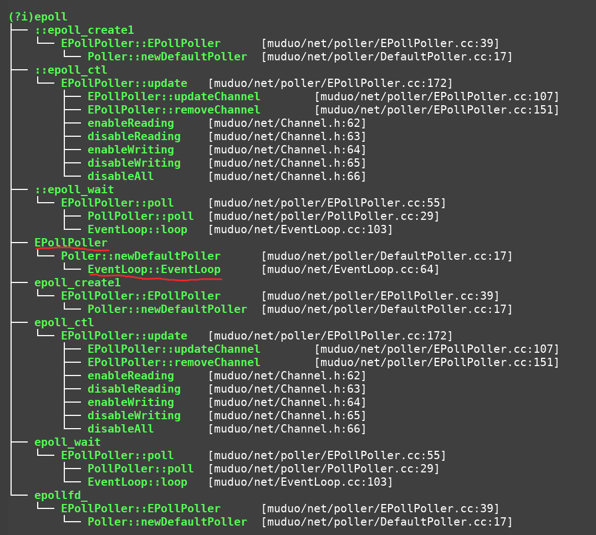

- 看到了EventLoop, EpollPoller等关键信息. 这些是poller相关的，一般会跑在poller线程中, 监听一组事件，事件激活, 或读或写, 然后调用回调函数, 处理收到的信息.
- {disable, enable}{Reading, Writing}：望文生义, 应该是注册感兴趣的事件.

同样需要关注：
- 能够创建几个EventLoop呢？
- 能否off-EventLoop处理呢？

-----


## 2. 看能否创建多个EventLoop

```bash
calltree.pl '(?i)create\w*(poller|eventloop)' '' 1 1 2
```
无结果.

```bash
calltree.pl '(?i)(create|new|make)\w*(poller|eventloop)' '' 1 1 2
```
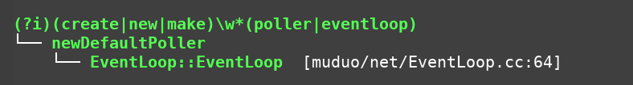

说明EventLoop里面有一个poller, poller管一组fd, 还得继续搜.

```bash
 calltree.pl '(?i)(poller|eventloop)\w*(make|create|new)' '' 1 1 2
```
无结果.

需要更换方向了, 因为EventLoop可能是用构造函数或者make_shared创建的.

```bash
cpptree.pl '(?i)EventLoop' '' 1 4
```
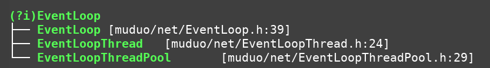

直观上看, 可以创建一个EventLoopThreadPool，管理一组EventLoopThread, 每个EventLoopThread管理一个EventLoop, 一个EventLoop管理一组fd.

这说明，可以创建多个EventLoop, 具体server socket的监听和普通的socket收发能否在一个EventLoop中呢？ 这个需要深入代码阅读, 不再赘述.

----

## 3. off-EventLoop处理

耗时请求占用EventLoop的所在线程是不好的, 能不能offload给工作线程池呢？

搜搜含有loop字样的函数
```bash
 calltree.pl '(?i)loop' '' 1 1 1
```
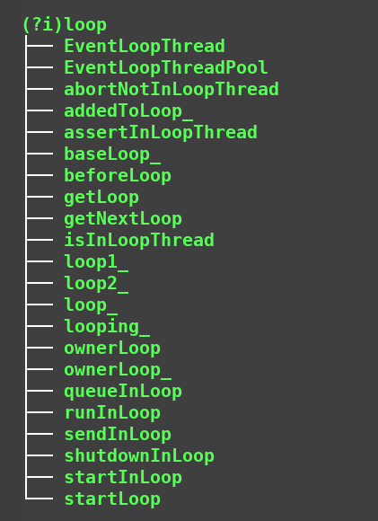

有inloop出现，接着搜`in*loop`

```
calltree.pl '(?i)in.*loop' '' 1 1 1
```

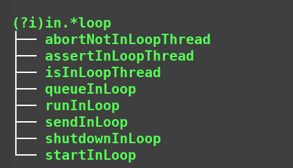

比如acceptor监听到一个connect请求进来，然后把connect请求accept之后创建socket，把socket放到其他的EventLoop中，这样的操作时间很短暂，显然可以in-loop处理. 源码中，明显区分了in-loop， 必然是有offload的处理逻辑. 此刻需要搜消息进入队列或者任务提交给工作线程池的逻辑.

接着搜：

```bash
calltree.pl '(?i)(dispatch|submit|queue|put|push)' '' 1 1 1
```
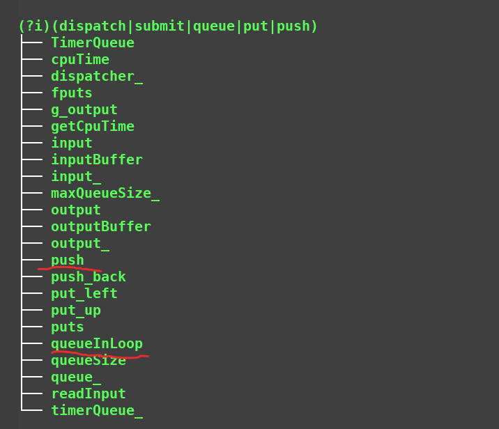

好像不太对.

还是从read操作着手吧.
```bash
calltree.pl 'read' '' 1 1 2
```
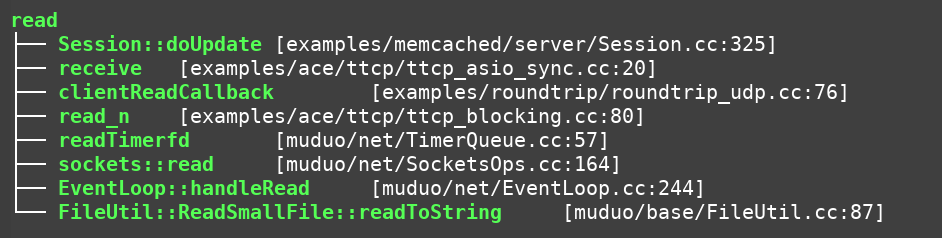

发现有一个EventLoop::handleRead的操作

搜handleRead函数

搜调用handleRead的函数, 无结果
```bash
calltree.pl '(?i)handleRead' '' 1 1 2
```
搜handleRead所调用的函数.
```
calltree.pl '(?i)handleRead' '' 0 1 1
```
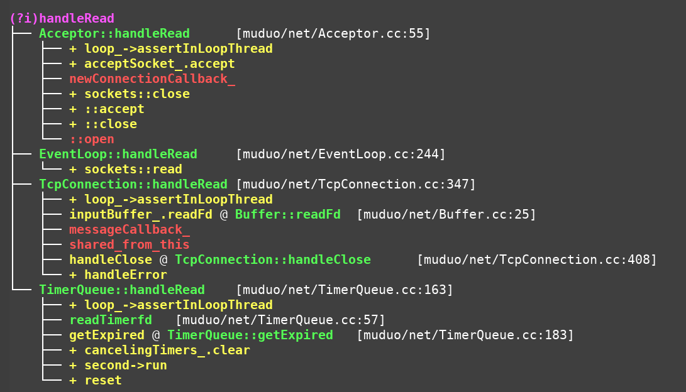

这说明, handleRead可能是回调函数

```bash
ag 'TcpConnection::handleRead'
```
```bash
muduo/net/TcpConnection.cc
54:      std::bind(&TcpConnection::handleRead, this, _1));
347:void TcpConnection::handleRead(Timestamp receiveTime)
363:    LOG_SYSERR << "TcpConnection::handleRead";
```

杀向代码：`muduo/net/TcpConnection.cc:54`

```cpp
TcpConnection::TcpConnection(EventLoop* loop,
                             const string& nameArg,
                             int sockfd,
                             const InetAddress& localAddr,
                             const InetAddress& peerAddr)
  : loop_(CHECK_NOTNULL(loop)),
    name_(nameArg),
    state_(kConnecting),
    reading_(true),
    socket_(new Socket(sockfd)),
    channel_(new Channel(loop, sockfd)),
    localAddr_(localAddr),
    peerAddr_(peerAddr),
    highWaterMark_(64*1024*1024)
{
  channel_->setReadCallback(
      std::bind(&TcpConnection::handleRead, this, _1));
  channel_->setWriteCallback(
      std::bind(&TcpConnection::handleWrite, this));
  channel_->setCloseCallback(
      std::bind(&TcpConnection::handleClose, this));
  channel_->setErrorCallback(
      std::bind(&TcpConnection::handleError, this));
  LOG_DEBUG << "TcpConnection::ctor[" <<  name_ << "] at " << this
            << " fd=" << sockfd;
  socket_->setKeepAlive(true);
}
```

此处略去细节， 总之：

- TcpConnection::handleRead安装在Channel.readCallback_上(`muduo/net/Channel.h:43`)
- TcpConnection::handleRead会把收到的信息发给自己内部回调messageCallback_

直接搜messageCallback. 

限于时间原因, 不想再搜了. 继续往下搜，一定是可以搜到的.
- 从read事件触发，到一路回调下来，在回调里把消息给工作线程池处理.
- 工作线程池处理完成后, 把响应给回到EventLoop，然后发出去. 

这里给出一些可能的搜索方向:

1. 找callback的定义
```bash
calltree.pl '^on[A-Z]\w+' '' 0 1 1
```

展示的东西比较多, 过滤掉example文件.

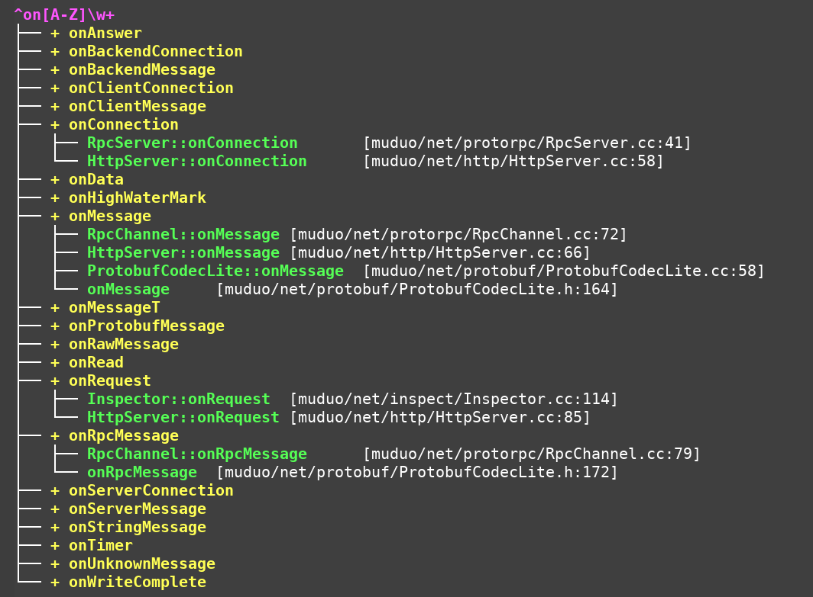

2. 找callback的安装点

```bash
calltree.pl '(?i)^set(\w+)callback' '' 1 1 1
```
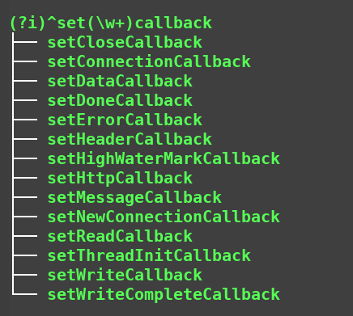

3. 找callback的触发点

```bash
calltree.pl '(?i)callback_' '' 1 1 2
```
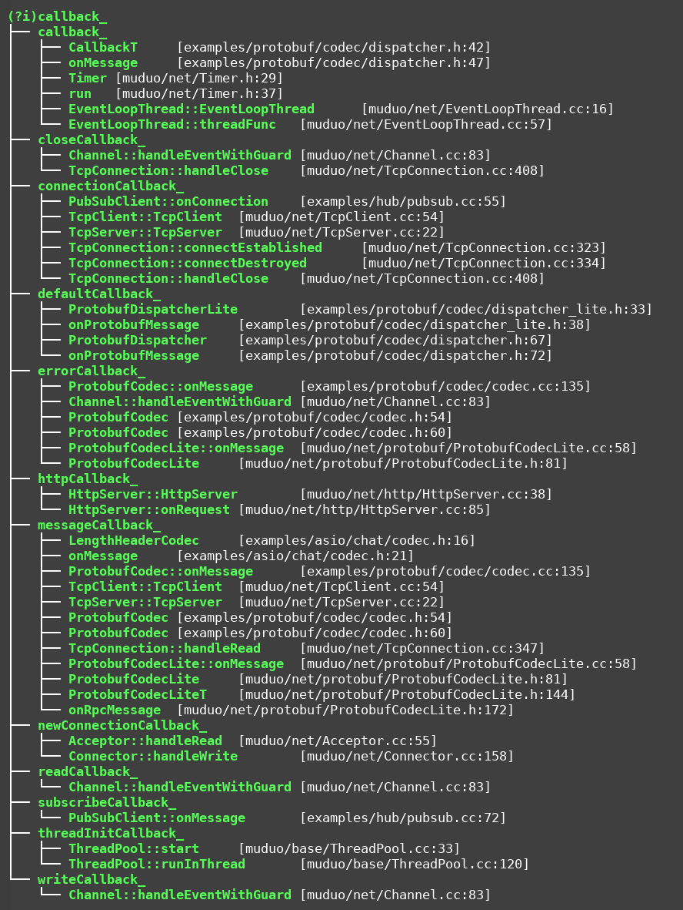

沿着这三个方向走， 必然可以发现很多重要逻辑.

----

## 4. 支不支持多个Acceptor呢？

```bash
calltree.pl '(?i)reuse.*port' '' 1 1 3
```

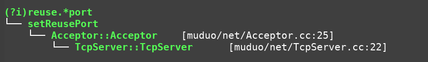

比较惊喜吧！ 猝发的connect可以很好地scale.

----

## 5. 继续深入代码研究细节

- 要彻底搞清楚代码细节，肯定还是要精读代码的.
- 读代码时，要抱着客观的心态看代码, 不应该吹毛求疵, 也不应该迷信权威.
- 为什么看代码呢？ 因为看代码是一种实证主义的基本方法.
- 看文档好还是看代码好呢？ 不建议看文档, 有代码就看代码, 看代码本身是一种盲搜的乐趣. 尤其是低于10 LevelDB当量的代码, 没有必要看文档. 当然一般的分布式存储系统的代码，在20~30 LevelDB当量, 建议还是先看看文档，把系统架构, control/data flow这些流程看懂了之后, 再看代码效果会更好. 如果是50 LevelDB当量以上的代码, 估计需要先看这一领域的综述和经典papers, 和更多的peers交流之后，代码阅读的难度可能会降低.
- 后续有机会给大家展示20~30 LevelDB当量的代码阅读过程.

