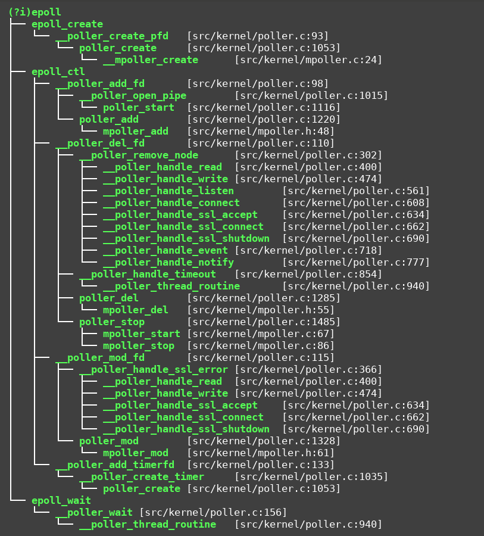
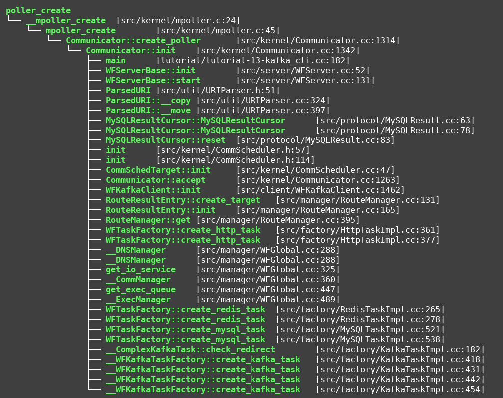
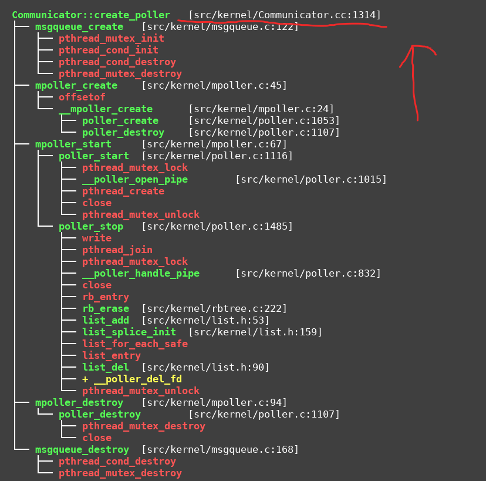
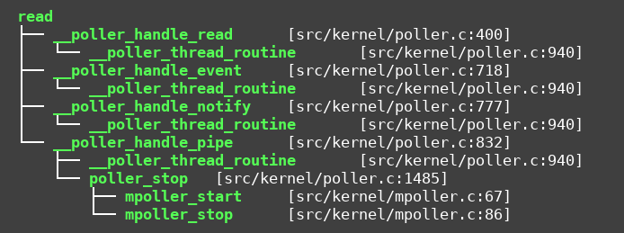
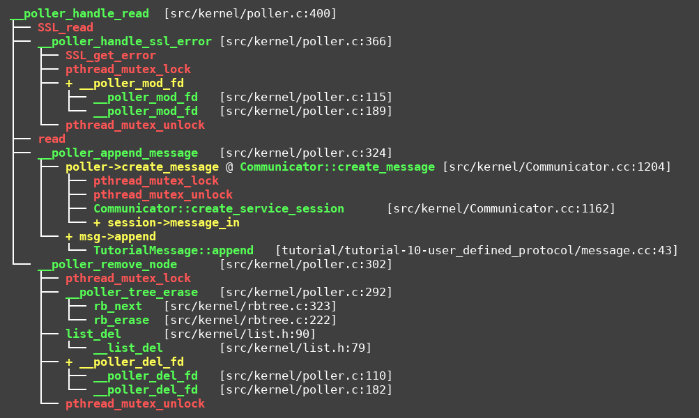
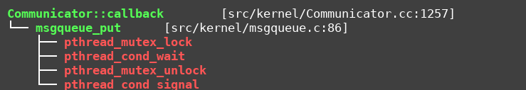
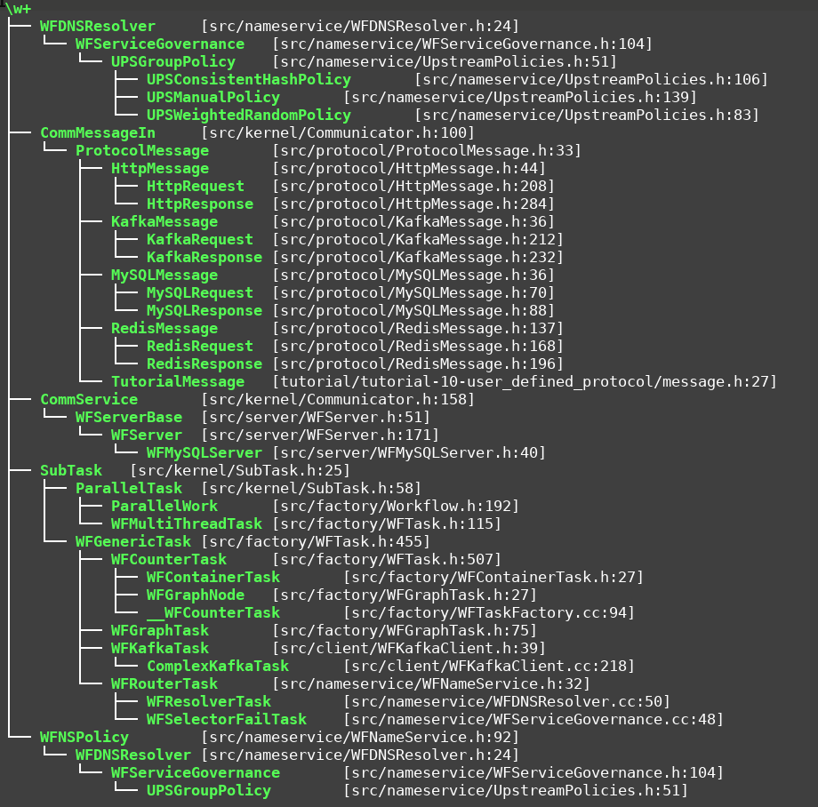

#! https://zhuanlan.zhihu.com/p/359104170
# 看看sogou workflow的源代码

## 总结
- repo: https://github.com/sogou/workflow.git
- 有效代码行数： 27333
- 函数个数： 1790,
- 代码当量： 1.84 LevelDB

从这点看的话，这个代码还是比较适合学习的， 不少搞C++朋友想找相关工程学习，笔者推荐学习代码当量<=10LevelDB的源码， 这个项目1.84当量，是比较好的选择.


## 1. 第一步找epoll相关调用

只要是网络库，第一步找epoll准没有错.

```bash
 calltree.pl '(?i)epoll' '' 1  1  4
```



可以看到处理网络的， 定时器的，还有pipe的. 如果对某一个函数比较感兴趣，可以继续深入下去.

一般有一个poller线程监听epoll fd上的注册事件，有事件触发，就开始处理.

这里面涉及两个问题： 
- 有多少个poller呢？ poller比较多，那么随着请求数量上升scale的能力就越强.
- 有没有长短请求的区分, 短请求，在poller所在的线程里面处理即可.长请求的话，占用poller事件太久, 会导致一些需要及时响应的请求会滞后处理, 所以长请求一般需要offload给其他的工作线程池处理. 前者是in-poller/in eventloop处理, 后者是off-eventloop处理.

----- 

## 2. 查看poller的数量

谁负责创建poller呢？
```bash
calltree.pl 'poller_create' '' 1  1  6
```



我们看到，最终是Communicator::init调用Communicator::create_poller创建poller, 并且有很多MySQL, Redis, Kafka, DNS所涉及的需要创建poller的函数, 这里面应该是不错的学习demo.

我们比较关心的是poller可以创建的数量:

```bash
calltree.pl 'Communicator::create_poller' '' 0 1 2
```



直接翻阅`src/kernel/Communicator.cc:1314`

```cpp
int Communicator::create_poller(size_t poller_threads)
{
  struct poller_params params = {
    .max_open_files   = 65536,
    .create_message   = Communicator::create_message,
    .partial_written  = Communicator::partial_written,
    .callback     = Communicator::callback,
    .context      = this 
  };

  this->queue = msgqueue_create(4096, sizeof (struct poller_result));
  if (this->queue)
  {
    this->mpoller = mpoller_create(&params, poller_threads);
    if (this->mpoller)
    {    
      if (mpoller_start(this->mpoller) >= 0)
        return 0;

      mpoller_destroy(this->mpoller);
    }    

    msgqueue_destroy(this->queue);
  }

  return -1;
}
```

可以看到传入poller_threads参数，即为poller的数量.

可以继续翻阅mpoller_create, mpoller_start等函数仔细阅读, 此处略过.

-----

## 3. poller offload给工作线程处理.

基本上，搜read|recv|recvmsg这三个函数受到消息后，观察怎样的处理的.

这儿可能会花点时间，盲搜的成分多一些.

```bash
calltree.pl 'read' '' 1 1 4
```



貌似_-poller_hander_read有戏, 看看这个函数的实现

```bash
calltree.pl '__poller_handle_read' '' 0 1 2
```



感觉有点复杂，看不懂!! 

打开代码看: `src/kernel/poller.c:400`, `src/kernel/poller.c +324`

感觉poller->cb这个大有玄机, 读到的消息都交给cb处理了.

我们搜搜cb是怎么初始化的

```bash
ag 'cb\s*=\s*'
```

发现
```bash
src/kernel/poller.c
1080:					poller->cb = params->callback;

```

直接杀向这行代码：src/kernel/poller.c：1080

发现又回到了poller_create, 我们继续找这个函数的调用链路，一一排查.


或者直接搜:
```bash
ag 'callback\s*='
```
其中有这么一行代码：
```
src/kernel/Communicator.cc
1320:		.callback			=	Communicator::callback,
```

那就直接看`Communicator::callback`

```bash
calltree.pl 'Communicator::callback' '' 0 1 2
```


发现有一个**msgqueue_put**的函数, 既然有这个函数，不难找到msgqueue_get函数的调用者. 队列模型已经出现了, 工作线程池不远矣. 后面略过.


----

## 4. 猝发的连接请求能否scale呢？

简单，搜reuse\w*port和reuse

发现，尽然没有reuseport，比较错愕.

----

## 5. 最后用cpptree.pl盲搜一下

```bash
cpptree.pl '\w+' '' 1 4
```




----

## 6. 彻底高明白，还需要好好读代码.

有兴趣可以看, 先撤了.